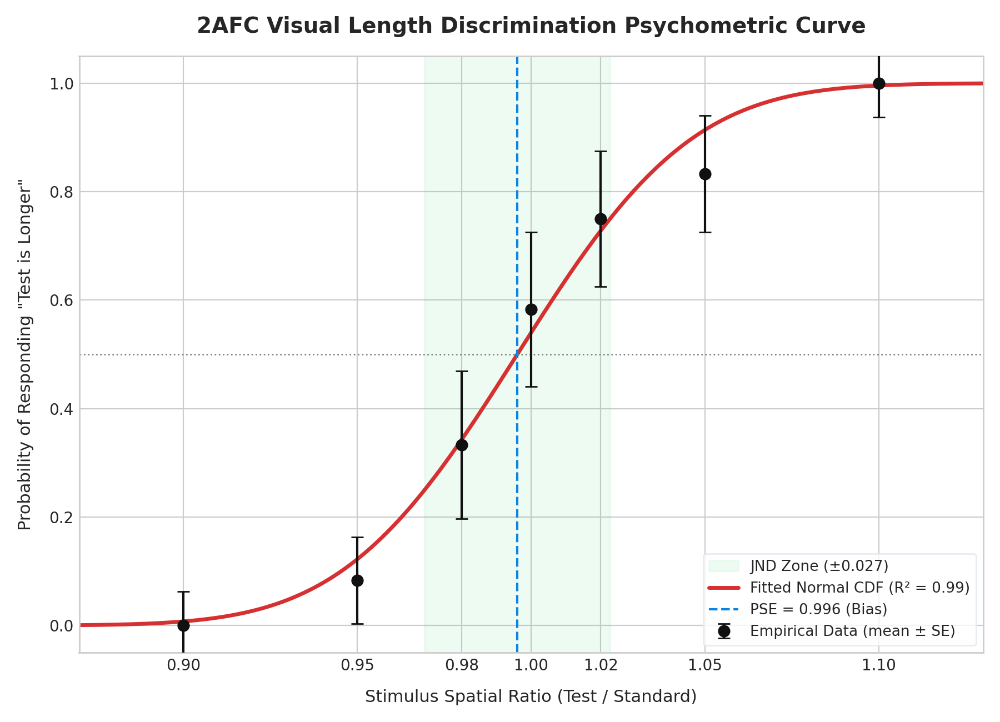

# Psychophysics Session Analysis Report

**Session ID:** `session_20260521_104027_SUB01`
**Participant ID:** `SUB01`
**Date/Time:** `2026-05-21T10:40:27.563306`

---

## 1. Executive Summary

This automated report presents the psychophysical assessment of visual length discrimination. By applying the **Method of Constant Stimuli** under a **Two-Alternative Forced Choice (2AFC)** paradigm, we mapped the participant's sensory responses onto a cumulative normal distribution model to isolate behavioral indices of early cortical spatial coding.

| Metric | Measured Value | Ideal / Reference | Scientific Interpretation |
| :--- | :---: | :---: | :--- |
| **PSE** (Bias) | `0.9960` | `1.0000` | Point of Subjective Equality. Values < 1.0 indicate a left-stimulus bias. |
| **JND** (Sensitivity) | `0.0267` | Lower is better | Just Noticeable Difference. Represents absolute sensory noise limit. |
| **R²** (Goodness of Fit) | `0.9881` | `1.0000` | Explained variance by the Gaussian Cumulative Normal model. |
| **Accuracy** (Overall) | `88.10%` | — | Percent correct across all non-ambiguous ratios. |
| **Mean RT** (Reaction Time) | `0.629 s` | — | Average latency to render spatial judgment. |

---

## 2. Psychometric Curve Fitting

The visualization below represents the fitted psychometric curve. Raw data points represent the empirical probability of responding "Test stimulus is longer" at each ratio level, with binomial standard error bars indicating trial-by-trial variance.

*The shaded green zone represents the **JND Threshold Zone** ($[PSE - JND, PSE + JND]$), reflecting the spatial interval where sensory noise dominates and makes discrimination uncertain.*

---

## 3. Psychophysical Interpretations

1. **Sensory Bias (PSE = 0.9960):**
   - The participant exhibits virtually zero spatial bias. Spatial perception is accurately calibrated with physical line length.

2. **Visual Resolution Limit (JND = 0.0267):**
   - A JND of `0.0267` implies that a length difference of **`2.67%`** is required for the visual system to distinguish the test line from the standard line with 75% accuracy. This indicates high spatial acuity.

3. **Speed-Accuracy Dynamics:**
   - The average decision latency of `0.629 seconds` represents the time required to settle on a sensory decision. Portfolio analysis of reaction times can indicate whether cognitive control or fatigue influenced sensory thresholds.